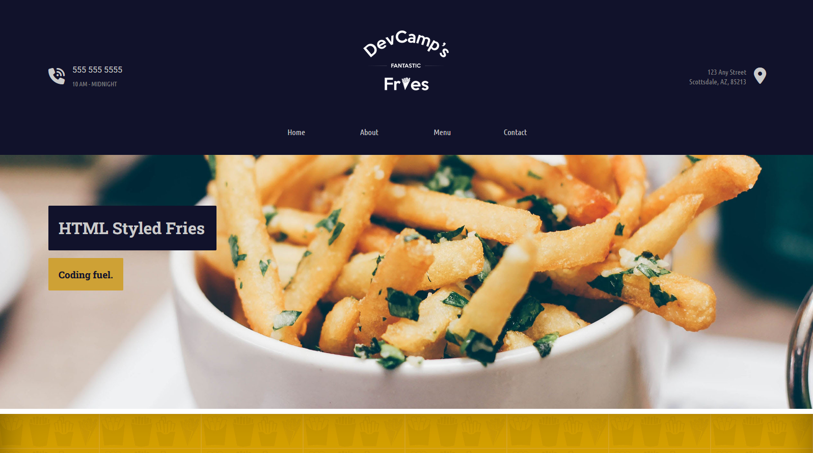

# Decamp Fantastic Fries

Este es el sitio web para un restaurante ficticio llamado **Devcamp Fantastic Fries**, desarrollado como parte del curso 'Coding Foundations' de devCamp.



## Descripción

La página simula un sitio web profesional para un restaurante de patatas fritas. Incluye:

-   Página de inicio con sección de contacto, horarios y ubicación.
-   Navegación a secciones: Home, About, Menu y Contact.
-   Integración con Google Maps.
-   Iconos de redes sociales.
-   Diseño responsive con estilos personalizados en CSS.

## Tecnologías utilizadas

-   HTML5
-   CSS3
-   Font Awesome (iconos)
-   Google Fonts
-   Diseño responsive (media queries)
-   Google Maps Embed

## Cómo usar

1. Clona este repositorio:
    ```bash
    git clone https://github.com/Maialen45/devcamp-web.git
    ```
2. Abre `index.html` con cualquier navegador para ver el sitio web.
